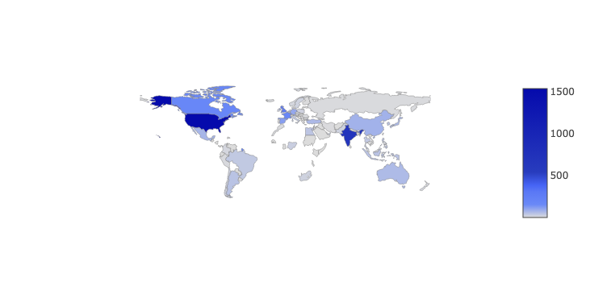

### Import Libraries


```python
import plotly.graph_objects as go
from plotly.offline import init_notebook_mode, iplot
import plotly.express as px
import pandas as pd
import matplotlib.pyplot as plt
import seaborn as sns
import numpy as np # linear algebra


df = pd.read_csv("netflix_titles_nov_2019.csv")

df.head()
```


<div>
<style scoped>
    .dataframe tbody tr th:only-of-type {
        vertical-align: middle;
    }

    .dataframe tbody tr th {
        vertical-align: top;
    }

    .dataframe thead th {
        text-align: right;
    }
</style>
<table border="1" class="dataframe">
  <thead>
    <tr style="text-align: right;">
      <th></th>
      <th>show_id</th>
      <th>title</th>
      <th>director</th>
      <th>cast</th>
      <th>country</th>
      <th>date_added</th>
      <th>release_year</th>
      <th>rating</th>
      <th>duration</th>
      <th>listed_in</th>
      <th>description</th>
      <th>type</th>
    </tr>
  </thead>
  <tbody>
    <tr>
      <th>0</th>
      <td>81193313</td>
      <td>Chocolate</td>
      <td>NaN</td>
      <td>Ha Ji-won, Yoon Kye-sang, Jang Seung-jo, Kang ...</td>
      <td>South Korea</td>
      <td>November 30, 2019</td>
      <td>2019</td>
      <td>TV-14</td>
      <td>1 Season</td>
      <td>International TV Shows, Korean TV Shows, Roman...</td>
      <td>Brought together by meaningful meals in the pa...</td>
      <td>TV Show</td>
    </tr>
    <tr>
      <th>1</th>
      <td>81197050</td>
      <td>Guatemala: Heart of the Mayan World</td>
      <td>Luis Ara, Ignacio Jaunsolo</td>
      <td>Christian Morales</td>
      <td>NaN</td>
      <td>November 30, 2019</td>
      <td>2019</td>
      <td>TV-G</td>
      <td>67 min</td>
      <td>Documentaries, International Movies</td>
      <td>From Sierra de las Minas to Esquipulas, explor...</td>
      <td>Movie</td>
    </tr>
    <tr>
      <th>2</th>
      <td>81213894</td>
      <td>The Zoya Factor</td>
      <td>Abhishek Sharma</td>
      <td>Sonam Kapoor, Dulquer Salmaan, Sanjay Kapoor, ...</td>
      <td>India</td>
      <td>November 30, 2019</td>
      <td>2019</td>
      <td>TV-14</td>
      <td>135 min</td>
      <td>Comedies, Dramas, International Movies</td>
      <td>A goofy copywriter unwittingly convinces the I...</td>
      <td>Movie</td>
    </tr>
    <tr>
      <th>3</th>
      <td>81082007</td>
      <td>Atlantics</td>
      <td>Mati Diop</td>
      <td>Mama Sane, Amadou Mbow, Ibrahima Traore, Nicol...</td>
      <td>France, Senegal, Belgium</td>
      <td>November 29, 2019</td>
      <td>2019</td>
      <td>TV-14</td>
      <td>106 min</td>
      <td>Dramas, Independent Movies, International Movies</td>
      <td>Arranged to marry a rich man, young Ada is cru...</td>
      <td>Movie</td>
    </tr>
    <tr>
      <th>4</th>
      <td>80213643</td>
      <td>Chip and Potato</td>
      <td>NaN</td>
      <td>Abigail Oliver, Andrea Libman, Briana Buckmast...</td>
      <td>Canada, United Kingdom</td>
      <td>NaN</td>
      <td>2019</td>
      <td>TV-Y</td>
      <td>2 Seasons</td>
      <td>Kids' TV</td>
      <td>Lovable pug Chip starts kindergarten, makes ne...</td>
      <td>TV Show</td>
    </tr>
  </tbody>
</table>
</div>


Shape of the dataset


```python
df.shape
```


    (5837, 12)


Name of the columns


```python
df.columns
```


    Index(['show_id', 'title', 'director', 'cast', 'country', 'date_added',
           'release_year', 'rating', 'duration', 'listed_in', 'description',
           'type'],
          dtype='object')


Check for NULL Values


```python
df.isnull().sum()
```


    show_id            0
    title              0
    director        1901
    cast             556
    country          427
    date_added       642
    release_year       0
    rating            10
    duration           0
    listed_in          0
    description        0
    type               0
    dtype: int64


Check for unique values


```python
df.nunique()
```


    show_id         5837
    title           5780
    director        3108
    cast            5087
    country          527
    date_added      1092
    release_year      71
    rating            14
    duration         194
    listed_in        449
    description     5829
    type               2
    dtype: int64


Check for Duplicate values


```python
df.duplicated().sum()
```


    0


Make a copy of the dataset¶


```python
df = df.copy()
```


```python
df.shape
```


    (5837, 12)


```python
Drop NULL values
```


```python
df=df.dropna()
df.shape
```


    (3447, 12)


```python
df.head(10)
```


<div>
<style scoped>
    .dataframe tbody tr th:only-of-type {
        vertical-align: middle;
    }

    .dataframe tbody tr th {
        vertical-align: top;
    }

    .dataframe thead th {
        text-align: right;
    }
</style>
<table border="1" class="dataframe">
  <thead>
    <tr style="text-align: right;">
      <th></th>
      <th>show_id</th>
      <th>title</th>
      <th>director</th>
      <th>cast</th>
      <th>country</th>
      <th>date_added</th>
      <th>release_year</th>
      <th>rating</th>
      <th>duration</th>
      <th>listed_in</th>
      <th>description</th>
      <th>type</th>
    </tr>
  </thead>
  <tbody>
    <tr>
      <th>2</th>
      <td>81213894</td>
      <td>The Zoya Factor</td>
      <td>Abhishek Sharma</td>
      <td>Sonam Kapoor, Dulquer Salmaan, Sanjay Kapoor, ...</td>
      <td>India</td>
      <td>November 30, 2019</td>
      <td>2019</td>
      <td>TV-14</td>
      <td>135 min</td>
      <td>Comedies, Dramas, International Movies</td>
      <td>A goofy copywriter unwittingly convinces the I...</td>
      <td>Movie</td>
    </tr>
    <tr>
      <th>3</th>
      <td>81082007</td>
      <td>Atlantics</td>
      <td>Mati Diop</td>
      <td>Mama Sane, Amadou Mbow, Ibrahima Traore, Nicol...</td>
      <td>France, Senegal, Belgium</td>
      <td>November 29, 2019</td>
      <td>2019</td>
      <td>TV-14</td>
      <td>106 min</td>
      <td>Dramas, Independent Movies, International Movies</td>
      <td>Arranged to marry a rich man, young Ada is cru...</td>
      <td>Movie</td>
    </tr>
    <tr>
      <th>5</th>
      <td>81172754</td>
      <td>Crazy people</td>
      <td>Moses Inwang</td>
      <td>Ramsey Nouah, Chigul, Sola Sobowale, Ireti Doy...</td>
      <td>Nigeria</td>
      <td>November 29, 2019</td>
      <td>2018</td>
      <td>TV-14</td>
      <td>107 min</td>
      <td>Comedies, International Movies, Thrillers</td>
      <td>Nollywood star Ramsey Nouah learns that someon...</td>
      <td>Movie</td>
    </tr>
    <tr>
      <th>6</th>
      <td>81120982</td>
      <td>I Lost My Body</td>
      <td>Jérémy Clapin</td>
      <td>Hakim Faris, Victoire Du Bois, Patrick d'Assum...</td>
      <td>France</td>
      <td>November 29, 2019</td>
      <td>2019</td>
      <td>TV-MA</td>
      <td>81 min</td>
      <td>Dramas, Independent Movies, International Movies</td>
      <td>Romance, mystery and adventure intertwine as a...</td>
      <td>Movie</td>
    </tr>
    <tr>
      <th>7</th>
      <td>81227195</td>
      <td>Kalushi: The Story of Solomon Mahlangu</td>
      <td>Mandla Dube</td>
      <td>Thabo Rametsi, Thabo Malema, Welile Nzuza, Jaf...</td>
      <td>South Africa</td>
      <td>November 29, 2019</td>
      <td>2016</td>
      <td>TV-MA</td>
      <td>107 min</td>
      <td>Dramas, International Movies</td>
      <td>The life and times of iconic South African lib...</td>
      <td>Movie</td>
    </tr>
    <tr>
      <th>10</th>
      <td>81172899</td>
      <td>Payday</td>
      <td>Cheta Chukwu</td>
      <td>Baaj Adebule, Ebiye Victor, Meg Otanwa, Bisola...</td>
      <td>Nigeria</td>
      <td>November 29, 2019</td>
      <td>2018</td>
      <td>TV-MA</td>
      <td>110 min</td>
      <td>Comedies, Independent Movies, International Mo...</td>
      <td>After an expensive night out, two flatmates ge...</td>
      <td>Movie</td>
    </tr>
    <tr>
      <th>12</th>
      <td>81172908</td>
      <td>The Accidental Spy</td>
      <td>Roger Russell</td>
      <td>Ramsey Nouah, Christine Allado, Ayo Makun, Emm...</td>
      <td>Nigeria</td>
      <td>November 29, 2019</td>
      <td>2017</td>
      <td>TV-14</td>
      <td>104 min</td>
      <td>Action &amp; Adventure, Comedies, International Mo...</td>
      <td>Nursing a broken heart, an IT specialist moves...</td>
      <td>Movie</td>
    </tr>
    <tr>
      <th>14</th>
      <td>81172901</td>
      <td>The Island</td>
      <td>Toka McBaror</td>
      <td>Sambasa Nzeribe, Segun Arinze, Tokunbo Idowu, ...</td>
      <td>Nigeria</td>
      <td>November 29, 2019</td>
      <td>2018</td>
      <td>TV-14</td>
      <td>93 min</td>
      <td>Dramas, International Movies, Thrillers</td>
      <td>When a colonel uncovers controversial intel ab...</td>
      <td>Movie</td>
    </tr>
    <tr>
      <th>16</th>
      <td>81033086</td>
      <td>Holiday Rush</td>
      <td>Leslie Small</td>
      <td>Romany Malco, Sonequa Martin-Green, Darlene Lo...</td>
      <td>United States</td>
      <td>November 28, 2019</td>
      <td>2019</td>
      <td>TV-PG</td>
      <td>94 min</td>
      <td>Children &amp; Family Movies, Dramas</td>
      <td>A widowed radio DJ and his four spoiled kids n...</td>
      <td>Movie</td>
    </tr>
    <tr>
      <th>21</th>
      <td>60020826</td>
      <td>The Score</td>
      <td>Frank Oz</td>
      <td>Robert De Niro, Edward Norton, Marlon Brando, ...</td>
      <td>Germany, Canada, United States</td>
      <td>November 28, 2019</td>
      <td>2001</td>
      <td>R</td>
      <td>124 min</td>
      <td>Dramas, Thrillers</td>
      <td>Ready-to-retire safecracker Nick, flamboyant f...</td>
      <td>Movie</td>
    </tr>
  </tbody>
</table>
</div>


Convert Date Time format¶


```python
## add new features in the dataset
df["date_added"] = pd.to_datetime(df['date_added'])
df['year_added'] = df['date_added'].dt.year
df['month_added'] = df['date_added'].dt.month

df['season_count'] = df.apply(lambda x : x['duration'].split(" ")[0] if "Season" in x['duration'] else "", axis = 1)
df['duration'] = df.apply(lambda x : x['duration'].split(" ")[0] if "Season" not in x['duration'] else "", axis = 1)
df.head()
```


<div>
<style scoped>
    .dataframe tbody tr th:only-of-type {
        vertical-align: middle;
    }

    .dataframe tbody tr th {
        vertical-align: top;
    }

    .dataframe thead th {
        text-align: right;
    }
</style>
<table border="1" class="dataframe">
  <thead>
    <tr style="text-align: right;">
      <th></th>
      <th>show_id</th>
      <th>title</th>
      <th>director</th>
      <th>cast</th>
      <th>country</th>
      <th>date_added</th>
      <th>release_year</th>
      <th>rating</th>
      <th>duration</th>
      <th>listed_in</th>
      <th>description</th>
      <th>type</th>
      <th>year_added</th>
      <th>month_added</th>
      <th>season_count</th>
    </tr>
  </thead>
  <tbody>
    <tr>
      <th>2</th>
      <td>81213894</td>
      <td>The Zoya Factor</td>
      <td>Abhishek Sharma</td>
      <td>Sonam Kapoor, Dulquer Salmaan, Sanjay Kapoor, ...</td>
      <td>India</td>
      <td>2019-11-30</td>
      <td>2019</td>
      <td>TV-14</td>
      <td>135</td>
      <td>Comedies, Dramas, International Movies</td>
      <td>A goofy copywriter unwittingly convinces the I...</td>
      <td>Movie</td>
      <td>2019</td>
      <td>11</td>
      <td></td>
    </tr>
    <tr>
      <th>3</th>
      <td>81082007</td>
      <td>Atlantics</td>
      <td>Mati Diop</td>
      <td>Mama Sane, Amadou Mbow, Ibrahima Traore, Nicol...</td>
      <td>France, Senegal, Belgium</td>
      <td>2019-11-29</td>
      <td>2019</td>
      <td>TV-14</td>
      <td>106</td>
      <td>Dramas, Independent Movies, International Movies</td>
      <td>Arranged to marry a rich man, young Ada is cru...</td>
      <td>Movie</td>
      <td>2019</td>
      <td>11</td>
      <td></td>
    </tr>
    <tr>
      <th>5</th>
      <td>81172754</td>
      <td>Crazy people</td>
      <td>Moses Inwang</td>
      <td>Ramsey Nouah, Chigul, Sola Sobowale, Ireti Doy...</td>
      <td>Nigeria</td>
      <td>2019-11-29</td>
      <td>2018</td>
      <td>TV-14</td>
      <td>107</td>
      <td>Comedies, International Movies, Thrillers</td>
      <td>Nollywood star Ramsey Nouah learns that someon...</td>
      <td>Movie</td>
      <td>2019</td>
      <td>11</td>
      <td></td>
    </tr>
    <tr>
      <th>6</th>
      <td>81120982</td>
      <td>I Lost My Body</td>
      <td>Jérémy Clapin</td>
      <td>Hakim Faris, Victoire Du Bois, Patrick d'Assum...</td>
      <td>France</td>
      <td>2019-11-29</td>
      <td>2019</td>
      <td>TV-MA</td>
      <td>81</td>
      <td>Dramas, Independent Movies, International Movies</td>
      <td>Romance, mystery and adventure intertwine as a...</td>
      <td>Movie</td>
      <td>2019</td>
      <td>11</td>
      <td></td>
    </tr>
    <tr>
      <th>7</th>
      <td>81227195</td>
      <td>Kalushi: The Story of Solomon Mahlangu</td>
      <td>Mandla Dube</td>
      <td>Thabo Rametsi, Thabo Malema, Welile Nzuza, Jaf...</td>
      <td>South Africa</td>
      <td>2019-11-29</td>
      <td>2016</td>
      <td>TV-MA</td>
      <td>107</td>
      <td>Dramas, International Movies</td>
      <td>The life and times of iconic South African lib...</td>
      <td>Movie</td>
      <td>2019</td>
      <td>11</td>
      <td></td>
    </tr>
  </tbody>
</table>
</div>


### Data Visualization

Plot Movie and TV Shows


```python
# count plot on single categorical variable
sns.countplot(x ='type', data = df)
fig = plt.gcf()
fig.set_size_inches(10,10)
plt.title('Type')
 
# Show the plot
plt.show()
```


    

    


Rating of TV Shows and Movies


```python
ax = sns.countplot(x=df['rating'],
                   order=df['rating'].value_counts(ascending=False).index);

abs_values = df['rating'].value_counts(ascending=False).values

ax.bar_label(container=ax.containers[0], labels=abs_values)
plt.title('Rating')
plt.show()
```


    

    


Relation between Type and Rating


```python
sns.countplot(x ='rating', hue = "type", data = df)
plt.title('Relation between Type and Rating')
 
# Show the plot
plt.show()
```


    

    


Pie-chart for the Type: Movie and TV Shows¶

Pie-chart for Rating¶


```python
df['rating'].value_counts().plot.pie(autopct='%1.1f%%',shadow=True,figsize=(10,8))
plt.title('Rating')
plt.show()
```


    

    


Sort Content by old movies on Netflix


```python
small = df.sort_values("release_year", ascending = True)
small = small[small['duration'] != ""]
small[['title', "release_year"]][:15]
```


<div>
<style scoped>
    .dataframe tbody tr th:only-of-type {
        vertical-align: middle;
    }

    .dataframe tbody tr th {
        vertical-align: top;
    }

    .dataframe thead th {
        text-align: right;
    }
</style>
<table border="1" class="dataframe">
  <thead>
    <tr style="text-align: right;">
      <th></th>
      <th>title</th>
      <th>release_year</th>
    </tr>
  </thead>
  <tbody>
    <tr>
      <th>4931</th>
      <td>The Battle of Midway</td>
      <td>1942</td>
    </tr>
    <tr>
      <th>4940</th>
      <td>Tunisian Victory</td>
      <td>1944</td>
    </tr>
    <tr>
      <th>4923</th>
      <td>Know Your Enemy - Japan</td>
      <td>1945</td>
    </tr>
    <tr>
      <th>3085</th>
      <td>The Stranger</td>
      <td>1946</td>
    </tr>
    <tr>
      <th>4924</th>
      <td>Let There Be Light</td>
      <td>1946</td>
    </tr>
    <tr>
      <th>4939</th>
      <td>Thunderbolt</td>
      <td>1947</td>
    </tr>
    <tr>
      <th>5817</th>
      <td>White Christmas</td>
      <td>1954</td>
    </tr>
    <tr>
      <th>257</th>
      <td>Rebel Without a Cause</td>
      <td>1955</td>
    </tr>
    <tr>
      <th>220</th>
      <td>Forbidden Planet</td>
      <td>1956</td>
    </tr>
    <tr>
      <th>204</th>
      <td>Cat on a Hot Tin Roof</td>
      <td>1958</td>
    </tr>
    <tr>
      <th>222</th>
      <td>Gigi</td>
      <td>1958</td>
    </tr>
    <tr>
      <th>4199</th>
      <td>Ujala</td>
      <td>1959</td>
    </tr>
    <tr>
      <th>4195</th>
      <td>Singapore</td>
      <td>1960</td>
    </tr>
    <tr>
      <th>203</th>
      <td>Butterfield 8</td>
      <td>1960</td>
    </tr>
    <tr>
      <th>254</th>
      <td>Ocean's Eleven</td>
      <td>1960</td>
    </tr>
  </tbody>
</table>
</div>


Sort Content by TV Shows on Netflix


```python
small = df.sort_values("release_year", ascending = True)
small = small[small['season_count'] != ""]
small[['title', "release_year"]][:15]
```


<div>
<style scoped>
    .dataframe tbody tr th:only-of-type {
        vertical-align: middle;
    }

    .dataframe tbody tr th {
        vertical-align: top;
    }

    .dataframe thead th {
        text-align: right;
    }
</style>
<table border="1" class="dataframe">
  <thead>
    <tr style="text-align: right;">
      <th></th>
      <th>title</th>
      <th>release_year</th>
    </tr>
  </thead>
  <tbody>
    <tr>
      <th>5073</th>
      <td>Ken Burns: The Civil War</td>
      <td>1990</td>
    </tr>
    <tr>
      <th>5721</th>
      <td>The Blue Planet: A Natural History of the Oceans</td>
      <td>2001</td>
    </tr>
    <tr>
      <th>5760</th>
      <td>Planet Earth: The Complete Collection</td>
      <td>2006</td>
    </tr>
    <tr>
      <th>4905</th>
      <td>Ouran High School Host Club</td>
      <td>2006</td>
    </tr>
    <tr>
      <th>3925</th>
      <td>Geronimo Stilton</td>
      <td>2011</td>
    </tr>
    <tr>
      <th>5639</th>
      <td>Frozen Planet</td>
      <td>2011</td>
    </tr>
    <tr>
      <th>4933</th>
      <td>The Fear</td>
      <td>2012</td>
    </tr>
    <tr>
      <th>777</th>
      <td>Reply 1997</td>
      <td>2012</td>
    </tr>
    <tr>
      <th>3715</th>
      <td>Brave Miss World</td>
      <td>2013</td>
    </tr>
    <tr>
      <th>5341</th>
      <td>Oliver Stone's Untold History of the United St...</td>
      <td>2013</td>
    </tr>
    <tr>
      <th>5269</th>
      <td>Sadqay Tumhare</td>
      <td>2014</td>
    </tr>
    <tr>
      <th>385</th>
      <td>Black Money Love</td>
      <td>2014</td>
    </tr>
    <tr>
      <th>776</th>
      <td>Reply 1994</td>
      <td>2014</td>
    </tr>
    <tr>
      <th>5116</th>
      <td>Metallica: Some Kind of Monster</td>
      <td>2014</td>
    </tr>
    <tr>
      <th>5129</th>
      <td>Camelia la Texana</td>
      <td>2014</td>
    </tr>
  </tbody>
</table>
</div>


### Content from Different Countries


```python
country_codes = {'afghanistan': 'AFG',
 'albania': 'ALB',
 'algeria': 'DZA',
 'american samoa': 'ASM',
 'andorra': 'AND',
 'angola': 'AGO',
 'anguilla': 'AIA',
 'antigua and barbuda': 'ATG',
 'argentina': 'ARG',
 'armenia': 'ARM',
 'aruba': 'ABW',
 'australia': 'AUS',
 'austria': 'AUT',
 'azerbaijan': 'AZE',
 'bahamas': 'BHM',
 'bahrain': 'BHR',
 'bangladesh': 'BGD',
 'barbados': 'BRB',
 'belarus': 'BLR',
 'belgium': 'BEL',
 'belize': 'BLZ',
 'benin': 'BEN',
 'bermuda': 'BMU',
 'bhutan': 'BTN',
 'bolivia': 'BOL',
 'bosnia and herzegovina': 'BIH',
 'botswana': 'BWA',
 'brazil': 'BRA',
 'british virgin islands': 'VGB',
 'brunei': 'BRN',
 'bulgaria': 'BGR',
 'burkina faso': 'BFA',
 'burma': 'MMR',
 'burundi': 'BDI',
 'cabo verde': 'CPV',
 'cambodia': 'KHM',
 'cameroon': 'CMR',
 'canada': 'CAN',
 'cayman islands': 'CYM',
 'central african republic': 'CAF',
 'chad': 'TCD',
 'chile': 'CHL',
 'china': 'CHN',
 'colombia': 'COL',
 'comoros': 'COM',
 'congo democratic': 'COD',
 'Congo republic': 'COG',
 'cook islands': 'COK',
 'costa rica': 'CRI',
 "cote d'ivoire": 'CIV',
 'croatia': 'HRV',
 'cuba': 'CUB',
 'curacao': 'CUW',
 'cyprus': 'CYP',
 'czech republic': 'CZE',
 'denmark': 'DNK',
 'djibouti': 'DJI',
 'dominica': 'DMA',
 'dominican republic': 'DOM',
 'ecuador': 'ECU',
 'egypt': 'EGY',
 'el salvador': 'SLV',
 'equatorial guinea': 'GNQ',
 'eritrea': 'ERI',
 'estonia': 'EST',
 'ethiopia': 'ETH',
 'falkland islands': 'FLK',
 'faroe islands': 'FRO',
 'fiji': 'FJI',
 'finland': 'FIN',
 'france': 'FRA',
 'french polynesia': 'PYF',
 'gabon': 'GAB',
 'gambia, the': 'GMB',
 'georgia': 'GEO',
 'germany': 'DEU',
 'ghana': 'GHA',
 'gibraltar': 'GIB',
 'greece': 'GRC',
 'greenland': 'GRL',
 'grenada': 'GRD',
 'guam': 'GUM',
 'guatemala': 'GTM',
 'guernsey': 'GGY',
 'guinea-bissau': 'GNB',
 'guinea': 'GIN',
 'guyana': 'GUY',
 'haiti': 'HTI',
 'honduras': 'HND',
 'hong kong': 'HKG',
 'hungary': 'HUN',
 'iceland': 'ISL',
 'india': 'IND',
 'indonesia': 'IDN',
 'iran': 'IRN',
 'iraq': 'IRQ',
 'ireland': 'IRL',
 'isle of man': 'IMN',
 'israel': 'ISR',
 'italy': 'ITA',
 'jamaica': 'JAM',
 'japan': 'JPN',
 'jersey': 'JEY',
 'jordan': 'JOR',
 'kazakhstan': 'KAZ',
 'kenya': 'KEN',
 'kiribati': 'KIR',
 'north korea': 'PRK',
 'south korea': 'KOR',
 'kosovo': 'KSV',
 'kuwait': 'KWT',
 'kyrgyzstan': 'KGZ',
 'laos': 'LAO',
 'latvia': 'LVA',
 'lebanon': 'LBN',
 'lesotho': 'LSO',
 'liberia': 'LBR',
 'libya': 'LBY',
 'liechtenstein': 'LIE',
 'lithuania': 'LTU',
 'luxembourg': 'LUX',
 'macau': 'MAC',
 'macedonia': 'MKD',
 'madagascar': 'MDG',
 'malawi': 'MWI',
 'malaysia': 'MYS',
 'maldives': 'MDV',
 'mali': 'MLI',
 'malta': 'MLT',
 'marshall islands': 'MHL',
 'mauritania': 'MRT',
 'mauritius': 'MUS',
 'mexico': 'MEX',
 'micronesia': 'FSM',
 'moldova': 'MDA',
 'monaco': 'MCO',
 'mongolia': 'MNG',
 'montenegro': 'MNE',
 'morocco': 'MAR',
 'mozambique': 'MOZ',
 'namibia': 'NAM',
 'nepal': 'NPL',
 'netherlands': 'NLD',
 'new caledonia': 'NCL',
 'new zealand': 'NZL',
 'nicaragua': 'NIC',
 'nigeria': 'NGA',
 'niger': 'NER',
 'niue': 'NIU',
 'northern mariana islands': 'MNP',
 'norway': 'NOR',
 'oman': 'OMN',
 'pakistan': 'PAK',
 'palau': 'PLW',
 'panama': 'PAN',
 'papua new guinea': 'PNG',
 'paraguay': 'PRY',
 'peru': 'PER',
 'philippines': 'PHL',
 'poland': 'POL',
 'portugal': 'PRT',
 'puerto rico': 'PRI',
 'qatar': 'QAT',
 'romania': 'ROU',
 'russia': 'RUS',
 'rwanda': 'RWA',
 'saint kitts and nevis': 'KNA',
 'saint lucia': 'LCA',
 'saint martin': 'MAF',
 'saint pierre and miquelon': 'SPM',
 'saint vincent and the grenadines': 'VCT',
 'samoa': 'WSM',
 'san marino': 'SMR',
 'sao tome and principe': 'STP',
 'saudi arabia': 'SAU',
 'senegal': 'SEN',
 'serbia': 'SRB',
 'seychelles': 'SYC',
 'sierra leone': 'SLE',
 'singapore': 'SGP',
 'sint maarten': 'SXM',
 'slovakia': 'SVK',
 'slovenia': 'SVN',
 'solomon islands': 'SLB',
 'somalia': 'SOM',
 'south africa': 'ZAF',
 'south sudan': 'SSD',
 'spain': 'ESP',
 'sri lanka': 'LKA',
 'sudan': 'SDN',
 'suriname': 'SUR',
 'swaziland': 'SWZ',
 'sweden': 'SWE',
 'switzerland': 'CHE',
 'syria': 'SYR',
 'taiwan': 'TWN',
 'tajikistan': 'TJK',
 'tanzania': 'TZA',
 'thailand': 'THA',
 'timor-leste': 'TLS',
 'togo': 'TGO',
 'tonga': 'TON',
 'trinidad and tobago': 'TTO',
 'tunisia': 'TUN',
 'turkey': 'TUR',
 'turkmenistan': 'TKM',
 'tuvalu': 'TUV',
 'uganda': 'UGA',
 'ukraine': 'UKR',
 'united arab emirates': 'ARE',
 'united kingdom': 'GBR',
 'united states': 'USA',
 'uruguay': 'URY',
 'uzbekistan': 'UZB',
 'vanuatu': 'VUT',
 'venezuela': 'VEN',
 'vietnam': 'VNM',
 'virgin islands': 'VGB',
 'west bank': 'WBG',
 'yemen': 'YEM',
 'zambia': 'ZMB',
 'zimbabwe': 'ZWE'}

## countries 
from collections import Counter
colorscale = ["#f7fbff", "#ebf3fb", "#deebf7", "#d2e3f3", "#c6dbef", "#b3d2e9", "#9ecae1",
    "#85bcdb", "#6baed6", "#57a0ce", "#4292c6", "#3082be", "#2171b5", "#1361a9",
    "#08519c", "#0b4083", "#08306b"
]
    
def geoplot(ddf):
    country_with_code, country = {}, {}
    shows_countries = ", ".join(ddf['country'].dropna()).split(", ")
    for c,v in dict(Counter(shows_countries)).items():
        code = ""
        if c.lower() in country_codes:
            code = country_codes[c.lower()]
        country_with_code[code] = v
        country[c] = v

    data = [dict(
            type = 'choropleth',
            locations = list(country_with_code.keys()),
            z = list(country_with_code.values()),
            colorscale = [[0,"rgb(5, 10, 172)"],[0.65,"rgb(40, 60, 190)"],[0.75,"rgb(70, 100, 245)"],\
                        [0.80,"rgb(90, 120, 245)"],[0.9,"rgb(106, 137, 247)"],[1,"rgb(220, 220, 220)"]],
            autocolorscale = False,
            reversescale = True,
            marker = dict(
                line = dict (
                    color = 'gray',
                    width = 0.5
                ) ),
            colorbar = dict(
                autotick = False,
                title = ''),
          ) ]

    layout = dict(
        title = '',
        geo = dict(
            showframe = False,
            showcoastlines = False,
            projection = dict(
                type = 'Mercator'
            )
        )
    )

    fig = dict( data=data, layout=layout )
    iplot( fig, validate=False, filename='d3-world-map' )
    return country

country_vals = geoplot(df)
tabs = Counter(country_vals).most_common(25)

labels = [_[0] for _ in tabs][::-1]
values = [_[1] for _ in tabs][::-1]
trace1 = go.Bar(y=labels, x=values, orientation="h", name="", marker=dict(color="#a678de"))

data = [trace1]
layout = go.Layout(title="Countries with most content", height=700, legend=dict(x=0.1, y=1.1, orientation="h"))
fig = go.Figure(data, layout=layout)
fig.show()
```



### Distribution of Movie Duration


```python
import plotly.figure_factory as ff
x1 = d2['duration'].fillna(0.0).astype(float)
fig = ff.create_distplot([x1], ['a'], bin_size=0.7, curve_type='normal', colors=["#6ad49b"])
fig.update_layout(title_text='Distplot with Normal Distribution')
fig.show()
```


### What are the Top Categories?


```python
col = "listed_in"
categories = ", ".join(d2['listed_in']).split(", ")
counter_list = Counter(categories).most_common(50)
labels = [_[0] for _ in counter_list][::-1]
values = [_[1] for _ in counter_list][::-1]
trace1 = go.Bar(y=labels, x=values, orientation="h", name="TV Shows", marker=dict(color="#a678de"))

data = [trace1]
layout = go.Layout(title="Content added over the years", legend=dict(x=0.1, y=1.1, orientation="h"))
fig = go.Figure(data, layout=layout)
fig.show()
```


### Top Actors on Netflix with Most Movies


```python
def country_trace(country, flag = "movie"):
    df["from_us"] = df['country'].fillna("").apply(lambda x : 1 if country.lower() in x.lower() else 0)
    small = df[df["from_us"] == 1]
    if flag == "movie":
        small = small[small["duration"] != ""]
    else:
        small = small[small["season_count"] != ""]
    cast = ", ".join(small['cast'].fillna("")).split(", ")
    tags = Counter(cast).most_common(25)
    tags = [_ for _ in tags if "" != _[0]]

    labels, values = [_[0]+"  " for _ in tags], [_[1] for _ in tags]
    trace = go.Bar(y=labels[::-1], x=values[::-1], orientation="h", name="", marker=dict(color="#a678de"))
    return trace

from plotly.subplots import make_subplots
traces = []
titles = ["United States", "","India","", "United Kingdom", "Canada","", "Spain","", "Japan"]
for title in titles:
    if title != "":
        traces.append(country_trace(title))

fig = make_subplots(rows=2, cols=5, subplot_titles=titles)
fig.add_trace(traces[0], 1,1)
fig.add_trace(traces[1], 1,3)
fig.add_trace(traces[2], 1,5)
fig.add_trace(traces[3], 2,1)
fig.add_trace(traces[4], 2,3)
fig.add_trace(traces[5], 2,5)

fig.update_layout(height=1200, showlegend=False)
fig.show()
```


### Top Actors on Netflix with Most TV Shows


```python
traces = []
titles = ["United States","", "United Kingdom"]
for title in titles:
    if title != "":
        traces.append(country_trace(title, flag="tv_shows"))

fig = make_subplots(rows=1, cols=3, subplot_titles=titles)
fig.add_trace(traces[0], 1,1)
fig.add_trace(traces[1], 1,3)

fig.update_layout(height=600, showlegend=False)
fig.show()
```


### US Directors with the most content


```python
small = df[df["type"] == "Movie"]
small = small[small["country"] == "United States"]

col = "director"
categories = ", ".join(small[col].fillna("")).split(", ")
counter_list = Counter(categories).most_common(12)
counter_list = [_ for _ in counter_list if _[0] != ""]
labels = [_[0] for _ in counter_list][::-1]
values = [_[1] for _ in counter_list][::-1]
trace1 = go.Bar(y=labels, x=values, orientation="h", name="TV Shows", marker=dict(color="orange"))

data = [trace1]
layout = go.Layout(title="Movie Directors from the United States with the most content", legend=dict(x=0.1, y=1.1, orientation="h"))
fig = go.Figure(data, layout=layout)
fig.show()
```


### Stand Up Comedy in US


```python
tag = "Stand-Up Comedy"
df["relevant"] = df['listed_in'].fillna("").apply(lambda x : 1 if tag.lower() in x.lower() else 0)
small = df[df["relevant"] == 1]
small[small["country"] == "United States"][["title", "country","release_year"]].head(10)
```


<div>
<style scoped>
    .dataframe tbody tr th:only-of-type {
        vertical-align: middle;

</style>
<table border="1" class="dataframe">
  <thead>
    <tr style="text-align: right;">
      <th></th>
      <th>title</th>
      <th>country</th>
      <th>release_year</th>
    </tr>
  </thead>
  <tbody>
    <tr>
      <th>28</th>
      <td>Mike Birbiglia: The New One</td>
      <td>United States</td>
      <td>2019</td>
    </tr>
    <tr>
      <th>96</th>
      <td>Iliza Shlesinger: Unveiled</td>
      <td>United States</td>
      <td>2019</td>
    </tr>
    <tr>
      <th>103</th>
      <td>Jeff Dunham: All Over the Map</td>
      <td>United States</td>
      <td>2014</td>
    </tr>
    <tr>
      <th>136</th>
      <td>Jeff Garlin: Our Man In Chicago</td>
      <td>United States</td>
      <td>2019</td>
    </tr>
    <tr>
      <th>158</th>
      <td>Seth Meyers: Lobby Baby</td>
      <td>United States</td>
      <td>2019</td>
    </tr>
    <tr>
      <th>304</th>
      <td>Arsenio Hall: Smart &amp; Classy</td>
      <td>United States</td>
      <td>2019</td>
    </tr>
    <tr>
      <th>342</th>
      <td>Jenny Slate: Stage Fright</td>
      <td>United States</td>
      <td>2019</td>
    </tr>
    <tr>
      <th>411</th>
      <td>Deon Cole: Cole Hearted</td>
      <td>United States</td>
      <td>2019</td>
    </tr>
    <tr>
      <th>480</th>
      <td>Nikki Glaser: Bangin’</td>
      <td>United States</td>
      <td>2019</td>
    </tr>
    <tr>
      <th>545</th>
      <td>Jeff Dunham: Beside Himself</td>
      <td>United States</td>
      <td>2019</td>
    </tr>
  </tbody>
</table>
</div>


```python

```


```python

```


```python

```
